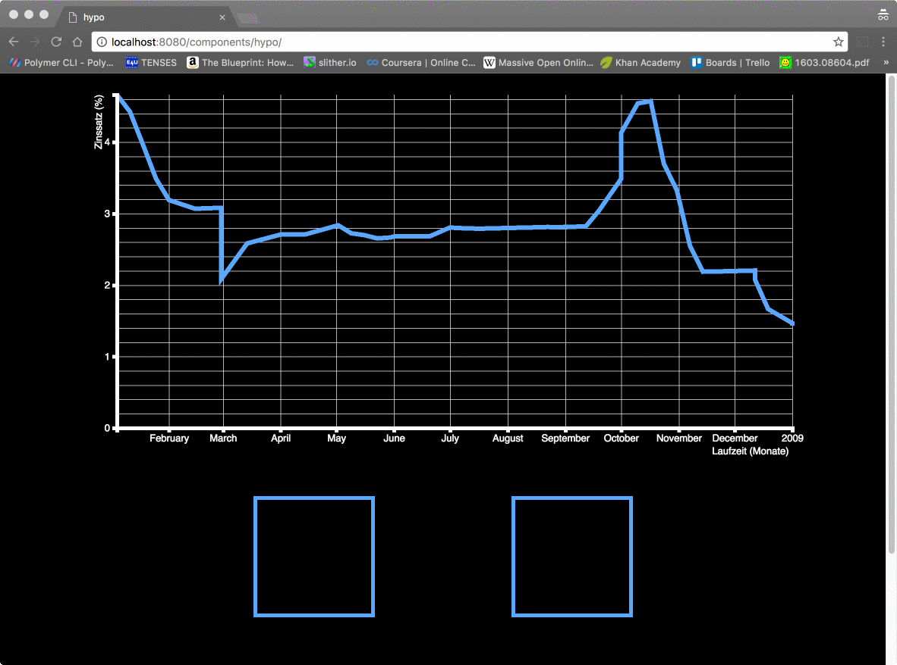
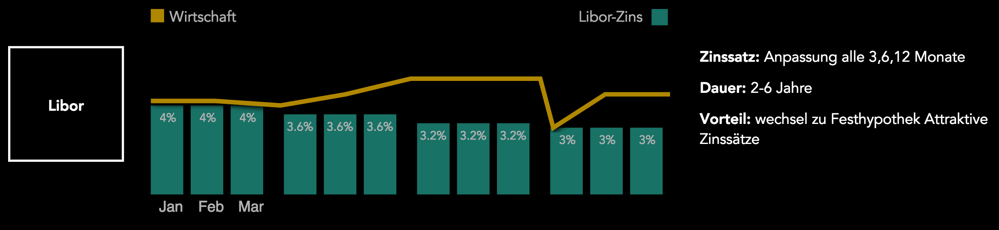

# \<hypo\>

## Hypo
It's a web application which is optimized for a beamer to explain mortgages.
(based on Polymer-starter-kit)
test

Prototype 1


Prototype 2


Technologies:
 - Polymer 1.4
 - Polymer-CLI
 - Nodejs
 - Gulp
 - Jquery
 - d3.js
 - Sass

## Installation

Install nodejs

```
1) https://nodejs.org/en/
2) npm install
```

Install the Polymer-CLI and Bower

```
1) https://www.npmjs.com/package/polymer-cli
2) npm install -g polymer-cli
```
```
1) npm install -g bower
2) bower install
```


## Viewing Your Application

```
$ npm run dev
```

## Building Your Application

```
$ npm run build
```
